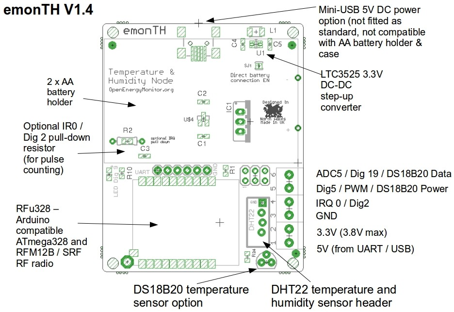
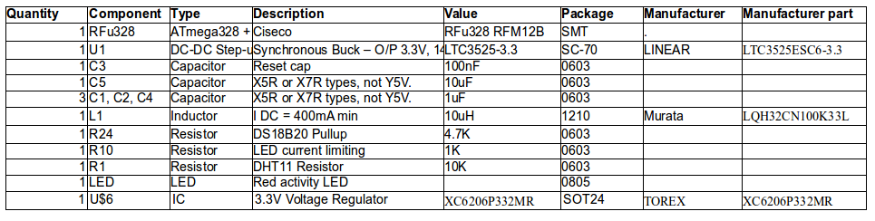

## emonTH V1.4

**Temperature and humidity monitoring noded**

Arduino compatible RFM12B wireless low power temperature and humidity battery powered wireless node.

Using the RFu328 and ATmega328 microcontroller as a common platform, emonTH can work with either an RFM12B or Ciseco SRF radio 

- Microcontroller: ATmega328 on RFu328 board
- Sensors: DHT22 Temperature & Humidity or DS18B20 temperature only
- Power: 2 x AA batteries in an on-board holder. LTC3525 3.3V DC-DC boost converter to extend battery life
- Radio: RFu328/ATmega328 emonTH can work with RFM12B or Ciseco SRF radio
- Battery life: 1-3 years. See blog post
- On-board LTC3525-3.3 DC-DC boost converter see emonTH hardware blog post

**RFM12B** 
The Rfu328 sold through the OpenEnergyMonitor shop was provided ready for use with the RFM12B. Check correct orientation of RFM12B before soldering. The crystal on the RFM12B should be on the same side as the tiny 16Mhz ATmega328 crystal on the RFu328. To use the RFM12B on the RFu328 a modified version of the JeeLib RF12 library has been created. This is called the RFu_JeeLib see the GitHub readme for info regarding changes to the code. When using the RFu_JeeLib, the RFM12B on the RFu328 can be used exactly as before, all code written for the emonTx V2, JeeNode etc should work just fine using using the RFu_JeeLib library. 

**SRF** 
The emonTH v1.4 was also compatible with the Ciseco SRF module. A complete RFu328 SRF module ws available from Ciseco. To use an OpenEnergyMonitor shop supplied RFu328 with an SRF, you'll need to remove one SMT resistor and rotate another by 90 degress. [Follow these instructions from Ciseco IN REVERSE!](http://openmicros.org/index.php/articles/88-ciseco-product-documentation/268).

**Power Consumption** 
See blog posts: 

- http://openenergymonitor.blogspot.com/2013/10/emonth-update-hardware.html
- http://openenergymonitor.blogspot.co.uk/2013/10/emonth-update-software-power.html 

### Eagle schematic and board file

Download both the schematic and board file and open in eagle, click on File > Switch to Board to navigate between schematic view and PCB Board view.

- Schematic: [emonTH V1.4.sch](emonTH V1.4.sch)
- Board: [emonTH V1.4.brd](emonTH V1.4.brd)
- BOM: [bom.json](bom.json)

### Schematic

### Board

**BOM**

### Port map

| Arduino        | ATmega328 Port  | Special Function  | emonTH V1.4            |
|----------------|-----------------|-------------------|------------------------|
| Analog 0 (D14) | PC0             |                   |                        |
| Analog 1 (D15) | PC1             |                   | 2x AA Battery Voltage  |
| Analog 2 (D16) | PC2             |                   |                        |
| Analog 3 (D17) | PC3             |                   |                        |
| Analog 4 (D18) | PC4             | (SDA)             | DHT22 Data             |
| Analog 5 (D19) | PC5             | (SCL)             | DS18B20 One-wire Data  |
| Analog 7 (D21) |                 |                   |                        |
| Digital 0      | PD0             | (RXD)             | FTDI Tx                |
| Digital 1      | PD1             | (TXD)             | FTDI Rx                |
| Digital 2      | PD2             | (int0) PWM        | Optical pulse IRQ0 / INT Wakeup from SRF |
| Digital 3      | PD3             | (int1) PWM        | RFM12B IRQ             |
| Digital 4      | PD4             |                   | RFM12B SEL / SRF Sleep |
| Digital 5      | PD5             | PWM               | DS18B20 PWR            |
| Digital 6      | PD6             | PWM               | DHT22 PWR              |
| Digital 7      | PD7             |                   |                        |
| Digital 8      | PB0             |                   | SRF Enable             |
| Digital 9      | PB1             | PWM               | LED                    |
| Digital 10     | PB2             | (SS) PWM          |                        |
| Digital 11     | PB3             | (MOSI) PWM        | RFM12 SDI (SRF IRQ Sleep ATSM3) |
| Digital 12     | PB4             | (MISO)            | RFM12 SDO              |
| Digital 13     | PB5             | (SCK)             | RFM12 SCK              |

### Open Hardware

Hardware designs (schematics and CAD) files are licensed under the [Creative Commons Attribution-ShareAlike 3.0 Unported License](http://creativecommons.org/licenses/by-sa/3.0/) and follow the terms of the [OSHW (Open-source hardware) Statement of Principles 1.0.](http://freedomdefined.org/OSHW)
